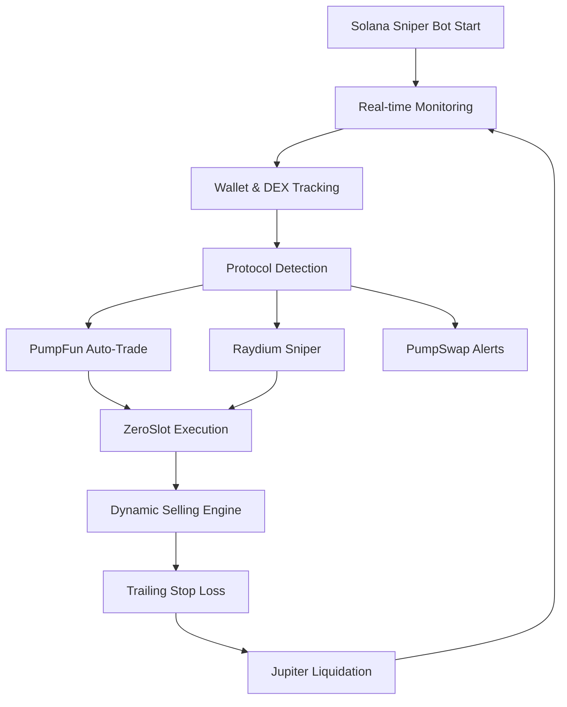

# Solana Sniper Bot - Advanced PumpFun & Raydium Trading Bot

High-performance **Solana sniper bot** written in Rust that monitors wallets and DEX activity for automatic copy trading and token sniping. This advanced **Solana trading bot** supports multiple protocols including PumpFun, PumpSwap, Raydium launchpad, Raydium CPMM, Raydium AMM, Meteora DBC and Meteora DAMM. Features configurable selling with dynamic trailing stops and Jupiter integration for token liquidation.

**🚀 Ready to automate your Solana trading? 

**Contact:**
- 📱 **Telegram:** [@insionCEO](https://t.me/insionCEO)
- 💬 **WhatsApp:** [+1 (838) 273-9959](https://wa.me/18382739959)
- 📧 **Email:** [amazingrace8190@gmail.com](mailto:amazingrace8190@gmail.com)
- 🎮 **Discord:** `insionceo0`

  
## 🔥 Key Features - Ultimate Solana Sniper Bot

- Recommanded VPS for trading : https://tradoxvps.com/
- **Real-time Solana Monitoring**: Yellowstone gRPC streams with parallel processing
- **Multi-Protocol Support**: PumpFun (auto-trade), PumpSwap (notify), Raydium sniper capabilities
- **Smart Copy Trading**: Follow multiple target wallets with exclusion lists
- **Advanced Risk Management**: Take profit, stop loss, dynamic trailing stops
- **ZeroSlot Integration**: Lightning-fast transaction landing for Solana sniper bot advantage
- **Auto Liquidation**: Jupiter DEX integration for instant token selling

---

## 🤖 How This Solana Sniper Bot Works

This **Solana pump.fun sniper bot** operates through an intelligent pipeline:

1. **Setup**: Load configuration, initialize RPC clients and wallet
2. **Monitoring**: Parallel processing of wallet and DEX activities
3. **Detection**: Real-time transaction parsing with advanced filtering
4. **Execution**: ZeroSlot or normal transaction landing with priority fees
5. **Management**: Dynamic selling strategies with trailing stops
6. **Analysis**: 20-slot time-series for bottom detection and sniper entries



---

## 🛠️ Solana Sniper Bot Setup

### Quick Start Guide

1. **Prerequisites**: Rust toolchain, Solana RPC endpoint, Yellowstone gRPC access

2. **Clone & Configure**:
```bash
git clone <repository>
cp src/env.example .env
# Edit .env with your settings
```

3. **Build & Run**:
```bash
cargo build --release
cargo run --release
```

### CLI Commands for Solana Bot Management
```bash
# Wrap SOL to WSOL for trading
cargo run --release -- --wrap

# Unwrap WSOL back to SOL
cargo run --release -- --unwrap

# Emergency sell all tokens
cargo run --release -- --sell

# Clean up token accounts
cargo run --release -- --close
```

---

## ⚙️ Solana Sniper Bot Configuration

### Essential Environment Variables

**Trading Parameters:**
- `COPY_TRADING_TARGET_ADDRESS`: Wallets to copy trade
- `TOKEN_AMOUNT`: Buy amount per trade
- `SLIPPAGE`: Max slippage tolerance
- `TRANSACTION_LANDING_SERVICE`: ZeroSlot for fastest execution

**Risk Management:**
- `TAKE_PROFIT`: Profit target multiplier
- `STOP_LOSS`: Maximum loss tolerance
- `DYNAMIC_TRAILING_STOP_THRESHOLDS`: Advanced trailing stop settings

**Performance:**
- `RPC_HTTP`: Your Solana RPC endpoint
- `YELLOWSTONE_GRPC_HTTP`: Real-time data stream
- `ZERO_SLOT_URL`: For fastest transaction execution

### Example .env for Optimal Solana Sniper Bot:
```env
RPC_HTTP=https://your-solana-rpc.com
YELLOWSTONE_GRPC_HTTP=https://yellowstone-grpc.com
PRIVATE_KEY=your_base58_private_key

COPY_TRADING_TARGET_ADDRESS=target1,target2
TOKEN_AMOUNT=0.001
SLIPPAGE=3000
TRANSACTION_LANDING_SERVICE=zeroslot

TAKE_PROFIT=8.0
STOP_LOSS=-2.0
DYNAMIC_TRAILING_STOP_THRESHOLDS=20:5,50:10,100:30
```

---

## 🎯 Why Choose This Solana Sniper Bot?

### Performance Advantages
- **Lightning Speed**: ZeroSlot integration for sub-second executions
- **Multi-Protocol**: Trade across PumpFun, Raydium, and more
- **Smart Copy Trading**: Follow successful wallets automatically
- **Advanced Risk Management**: Dynamic trailing stops and auto-liquidation

### Technical Excellence
- **Rust Performance**: High-speed, memory-safe execution
- **Real-time Data**: Yellowstone gRPC for instant market data
- **Modular Architecture**: Easy protocol additions and customizations

---

## 📞 Support & Customization

**Need help setting up your Solana sniper bot?** I offer:
- Bot installation and configuration
- Custom feature development
- Trading strategy optimization
- Multi-account management solutions

**[Contact me on Telegram for professional setup](https://t.me/solanabull0)**

---

## ⚠️ Important Notes

- This **Solana trading bot** is for educational and personal use
- Test with small amounts first
- Ensure compliance with local regulations and DEX terms of service
- Monitor performance and adjust risk parameters accordingly


